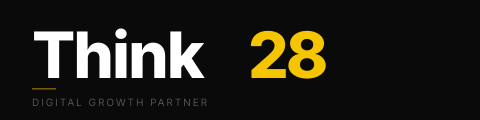

<p align="center">
  <picture>
    <source media="(prefers-color-scheme: dark)" srcset="docs/brand/think28-logo-reversed-white.svg">
    
  </picture>
</p>

<h1 align="center">Frame28</h1>

<p align="center"><strong>Graba hablando a cámara. Frame28 monta el resto.</strong></p>

<p align="center">
  Rótulos, títulos que aparecen al ritmo de tu voz, texto gigante que pasa por detrás de ti,<br>
  callouts donde señalas, pizarras y subtítulos. Sin editor de video. Sin plantillas que rellenar.
</p>

<p align="center">
  <a href="#instalación">Instalar</a> ·
  <a href="#cómo-funciona">Cómo funciona</a> ·
  <a href="https://frame28.t28.io/presentacion/">Guía paso a paso (presentación)</a> ·
  <a href="docs/guia-plugin.md">Guía del plugin</a> ·
  <a href="https://frame28.t28.io/roadmap/">Roadmap</a> ·
  <a href="https://t28.io">t28.io</a>
</p>

<p align="center"><sub>A Think28 product · <a href="https://t28.io">t28.io</a> · v0.5.1 · MIT</sub></p>

---

## Qué hace

Le das un clip de 30 segundos, 5 minutos o lo que sea, de una persona hablando a cámara. Frame28 escucha lo que
dice, entiende cuándo dice cada palabra, decide qué merece aparecer en pantalla y lo renderiza.

| Lo que dices | Lo que aparece |
|---|---|
| "Soy Javier, de Think28" | Tarjeta de identidad que se escribe sola |
| "y esto cambia **todo**" | La palabra clave, gigante, pasando por detrás de tu cabeza, letra a letra |
| "por aquí tenemos la consola…" | Un callout con línea justo donde apunta tu dedo |
| "tres cosas: rápido, barato, fiable" | Una lista donde el foco salta al decir cada una |
| "somos veinte veces más rápidos" | Una cifra que cuenta hasta 20× o una gráfica de barras con tu fila destacada |
| "así se ve el producto" | La captura entrando en pantalla |
| «eh… mmm… (silencio)» | Nada: los silencios largos, las muletillas y los falsos arranques desaparecen solos |
| (grabado bajito, con el ventilador de fondo) | Voz limpia y al volumen estándar de YouTube, sin tocar nada |
| todo el rato | Subtítulos limpios, frase a frase, o por palabras estilo Shorts (`pages`, `karaoke`); SRT/VTT para la plataforma |
| si es de una marca | La marca sale de su web (`frame28 brand from-site`): colores, fuente y logo con variantes; el montaje refuerza promesa, producto, pasos y prueba social |
| en otro idioma | `frame28 i18n extract/apply`: mismos tiempos, textos traducidos por el agente, subtítulos por palabras redistribuidos sobre el ritmo original |
| la miniatura | `frame28 cover`: fotograma + título con resaltado, insignia, logo y aro sobre el producto, en 16:9, 9:16 o 1:1, con las mismas fuentes que el vídeo |
| para vender | Gancho de 3 s, progreso de pasos, antes/después con barrido y CTA con precio, código y QR; zonas seguras de TikTok, Reels y Shorts |
| para Reels o Shorts | `frame28 reframe` pasa un clip apaisado a 9:16 siguiendo al hablante (o con fondo desenfocado); el montaje se hace en vertical |
| si el vídeo ya venía editado | `frame28 graphics` localiza sus rótulos, marca de agua, subtítulos y tarjetas, y los overlays nuevos van a las zonas y momentos libres |

El estilo es el de los *launch videos* de los laboratorios de IA: tres fondos, dos tipografías, esquinas de
encuadre, animaciones de un cuarto de segundo. Un evento visual cada dos a cuatro segundos, nunca más de ocho sin
nada. Lo estudiamos plano a plano antes de escribir una línea ([qué sacamos de ahí](research/01-analisis-video-referencia.md)).

## Para quién

- **Fundadores y equipos de producto** que anuncian algo y no tienen editor.
- **Formadores y consultores** que graban explicaciones y quieren que se vean cuidadas.
- **Equipos técnicos** que prefieren un JSON a una línea de tiempo con doscientas capas.

## Cómo funciona

Frame28 es un plugin de [Claude Code](https://claude.com/claude-code) más un CLI. El agente dirige; el CLI ejecuta.

```
tu clip ──▶ prep (voz limpia, −14 LUFS) ──▶ transcribe (tiempos por palabra) ──▶ cut (silencios y muletillas fuera) ──▶ speaker ──▶ gestures ──▶ matte
                                                                     │
                                       el agente escribe ──▶ storyboard.json ◀── reglas de dirección
                                                                     │
                                          build ──▶ composición HyperFrames ──▶ check ──▶ render ──▶ MP4
```

El **storyboard** es un JSON legible: qué overlay, con qué texto, en qué segundo, en qué zona. Lo escribe el
agente a partir de tu voz; tú lo corriges si quieres y se vuelve a renderizar. Nada de tocar HTML.

Debajo: [HyperFrames](https://github.com/heygen-com/hyperframes) para componer y renderizar,
[faster-whisper](https://github.com/SYSTRAN/faster-whisper) para los tiempos por palabra y
[RobustVideoMatting](https://github.com/PeterL1n/RobustVideoMatting) para recortarte del fondo y
[MediaPipe](https://github.com/google-ai-edge/mediapipe) para saber cuándo y hacia dónde señalas. Todo corre en tu
máquina; tu video no sale de ella.

## Instalación

¿Prefieres que te lleven de la mano? Abre el **[asistente de instalación](https://frame28.t28.io/instalar/)**: detecta tu
sistema, te da la línea con un botón de copiar, te cuenta qué vas a ver y tiene una lista de comprobación. O pídeselo a
Claude Code: «Instala Frame28 siguiendo https://frame28.t28.io/instalar.md».

**La forma rápida: una sola línea.** Un instalador interactivo que te dice en qué paso está y por qué, te pregunta
antes de cada cosa y sabe qué hacer en un equipo recién instalado (en Mac instala Homebrew si falta; en Windows, el
runtime de Visual C++). Instala ffmpeg, Node.js, uv, Claude Code, el motor de Frame28 y el plugin. Es seguro repetirlo.

Windows (Terminal o PowerShell):

```powershell
irm https://frame28.t28.io/install.ps1 | iex
```

macOS (Terminal, con [Homebrew](https://brew.sh)):

```bash
curl -fsSL https://frame28.t28.io/install.sh | bash
```

Al terminar, abre una terminal nueva, escribe `claude` e inicia sesión con tu cuenta de Claude. El instalador te dice
al final qué queda por hacer, si algo. Sin preguntas (para automatizar): `bash -s -- -y` en Mac o `$env:FRAME28_YES=1` en Windows.

**La forma manual**, por si quieres ver cada paso. ¿No eres informático? Hay una [presentación paso a paso](https://frame28.t28.io/presentacion/) que explica qué es, cómo instalarlo, cómo usarlo y cómo sacarle partido, sin jerga. También se puede abrir en local: `docs/presentacion/index.html`.

Necesitas [uv](https://docs.astral.sh/uv/) (trae Python 3.12), Node.js 22+, ffmpeg y Git (uv lo usa para instalar el CLI desde GitHub).

```bash
# El plugin (skills para Claude Code)
claude plugin marketplace add javierledesma28/frame28
claude plugin install frame28@think28

# El CLI
uv tool install --python 3.12 git+https://github.com/javierledesma28/frame28#subdirectory=plugin/cli
frame28 doctor
```

**Desde la v0.5 el plugin entra con tu cuenta de Frame28** (gratis para empezar). La primera vez, en Claude Code:
`/mcp` → el servidor `frame28` del plugin → *Authenticate*; se abre el navegador y te das de alta con tu email y un código
de un solo uso. El método del director (qué poner en pantalla, ganchos, marca) se sirve desde tu cuenta y según tu plan:
la cuenta gratuita monta en modo demo (marca Think28 y tarjeta final «Hecho con Frame28»); la Memoria de tu marca y lo demás
llegan con los planes de [frame28.app](https://frame28.app/#precios). El motor (el CLI `frame28`) sigue siendo código abierto
y no necesita cuenta.

`frame28 doctor` te dice qué falta y cómo instalarlo. Desde un clon local: `uv tool install --editable ./plugin/cli --python 3.12`.
Para ponerlo al día más adelante, mira [Actualizar](#actualizar).

## Actualizar

Frame28 son dos piezas y se actualizan por separado. Las dos órdenes son seguras de repetir. `frame28 doctor` te avisa
cuando hay una versión nueva de cualquiera de las dos y te dice cuál de estas órdenes toca.

**El plugin (las skills de Claude Code):**

```bash
claude plugin marketplace update think28
claude plugin update frame28@think28
```

Reinicia Claude Code para que cargue la versión nueva. `plugin update` solo hace algo cuando el número de versión del
plugin ha cambiado (cada release lo sube); si no hay nada nuevo responde «already at the latest version».

**El CLI (`frame28`):**

```bash
uv tool upgrade frame28
```

Lo reinstala desde GitHub en unos 15 segundos. Si lo instalaste con el instalador de una línea, también vale volver a
ejecutarlo: solo toca lo que haya cambiado.

**Comprueba** que todo está al día: `frame28 --version` debe decir la versión de la
[última release](https://github.com/javierledesma28/frame28/releases/latest) y `frame28 doctor` debe acabar en «Todo listo».

¿Lo tienes instalado desde un clon con `--editable`? `git pull`; si cambió `pyproject.toml` o la versión,
`uv tool install --editable ./plugin/cli --python 3.12 --reinstall`; si cambiaron las skills con la misma versión,
`claude plugin uninstall frame28@think28 && claude plugin install frame28@think28` (con la misma versión, `update` no
refresca el caché).

## Uso

En Claude Code, con el plugin instalado:

> Aquí está mi clip `charla.mp4`. Móntamelo.

Eso dispara `frame28-director`, que hace todo el flujo, te enseña una hoja de contacto del resultado y te entrega
el MP4. Si quieres tocar algo ("el título de los 12 segundos, más pequeño y a la derecha"), lo cambia en el
storyboard y vuelve a renderizar.

Las piezas también van sueltas: `frame28-transcribe`, `frame28-cutout`, `frame28-storyboard`, `frame28-broll`
(planos de apoyo propios o de Pexels/Pixabay, con la licencia guardada), `frame28-shorts` (de un vídeo largo a
varios shorts verticales con gancho, subtítulos y llamada a la acción), `frame28-i18n` (el mismo montaje en otro
idioma, mismos tiempos) y `frame28-compose`.
Y el CLI a mano, para quien prefiera la terminal:

```bash
frame28 prep charla.mp4 -o work
frame28 transcribe work/audio16k.wav -o work --lang es
frame28 speaker work/clip.mp4
frame28 build work/storyboard.json -o work/project && frame28 render work/project -o out/charla.mp4
```

## Cómo grabar para que salga bien

Cámara fija, fondo fijo, luz de frente, aire a un lado para los textos, frases cortas, gestos lentos. Diez consejos
concretos en la guía de grabación que Frame28 te da al empezar (documento `grabacion` del método). Y si quieres grabar una
demo que enseñe todas las técnicas, hay un [guion de 60 segundos con lo que decir y qué gesto hacer](docs/guion-demo.md).

## Estado y roadmap

v0.5.1 (sobre la v0.5.0) conecta el plugin con tu cuenta de Frame28: identidad, plan y método servidos desde frame28.app. El motor funciona
de punta a punta en clips reales (Windows, CPU): transcripción, jump cuts, limpieza de audio, gestos,
recorte, gráficas, marca, revelados GSAP, vertical con reencuadre, subtítulos por palabras, B-roll, detección de los
gráficos que ya trae un vídeo, overlays de venta, fábrica de shorts con variantes de gancho en lote, portada y versión
en otro idioma. Probado con un tutorial real de una marca DTC de kits de grabado además de los clips del autor. Y es
fiable para entregar: suite de pruebas, tiempo y coste por vídeo (`frame28 report`), y el sitio del producto en `site/`
con condiciones, base de conocimiento y curso online. Lo siguiente:

- B-roll contra la API real, marcadores de resultado y doblaje con voz sintética.
- Puertas de calidad automáticas (contraste, legibilidad, sonoridad) y gráficas ampliadas.
- Alineado con guion para nombres propios y karaoke exacto.
- Una interfaz sobre el storyboard, para quien no quiere ver una terminal, si la decisión de producto lo pide.

El roadmap completo, versión a versión y con el estado de cada ítem, está en
[frame28.t28.io/roadmap](https://frame28.t28.io/roadmap/) (fuente: `docs/roadmap/index.html`).

## Estructura del repositorio

| Ruta | Qué es |
|---|---|
| `plugin/` | el plugin: manifiesto, `.mcp.json` (servidor de Frame28), ocho skills que piden el método a tu cuenta y el CLI `frame28`. Es lo único que se instala |
| `.claude-plugin/marketplace.json` | este repo es su propio marketplace |
| `docs/guia-plugin.md` | el ciclo completo del plugin: crear, probar, publicar, consumir, securizar |
| `docs/brand/` | logos de Think28 (del [press kit](https://t28.io/press-kit.html)) |
| `docs/presentacion/` | la guía para personas no técnicas como presentación web (fuente `deck.html`, publicada como `index.html`) |
| `docs/install.ps1`, `docs/install.sh` | instaladores interactivos para Windows y macOS, servidos en frame28.t28.io |
| `docs/instalar/`, `docs/instalar.md` | asistente web de instalación y las instrucciones para que Claude Code instale Frame28 por ti |
| `research/04-roadmap-features.md` | investigación de features y repos a integrar, con roadmap priorizado |
| `research/06-monetizacion.md`, `research/07-producto-frame28-app.md` | cómo se monetiza Frame28 y la definición del producto frame28.app (oferta, precios propuestos, plan) |
| `docs/roadmap/` | el roadmap por versiones, publicado en [frame28.t28.io/roadmap](https://frame28.t28.io/roadmap/); los datos viven en el propio `index.html` |
| `scripts/release-check.py` | checklist de release: versión en los cuatro sitios, árbol limpio, tags, cuenta de `gh`, plugin validado, suite de pruebas en verde y confidencialidad |
| `plugin/cli/tests/` | pruebas de los módulos puros del CLI (`cd plugin/cli && uv run --group dev pytest`, 114 pruebas en unos 3 segundos) |
| `site/` | el sitio del producto [frame28.app](https://frame28.app) (estático, para Cloudflare Pages; se regenera con `uv run --with markdown python site/build.py`): landing ES/EN, condiciones, base de conocimiento y curso |
| `research/` | análisis del video de referencia, evaluación de repos, prueba HyperFrames vs Remotion |
| `poc/` | pruebas de concepto (los medios y renders no se versionan) |

## Licencias

Frame28 es MIT, © 2026 Think28. HyperFrames es Apache-2.0; faster-whisper, MIT; RobustVideoMatting, GPL-3.0
(su modelo se descarga de su repositorio la primera vez que se usa `frame28 matte` y `onnxruntime` lo carga dentro del
CLI; Frame28 no lo incluye ni lo redistribuye). Todas las piezas de terceros y sus licencias, en
[THIRD-PARTY-NOTICES.md](THIRD-PARTY-NOTICES.md).

<p align="center"><sub>Hecho por <a href="https://t28.io">Think28</a> · Barcelona · Buenos Aires · Ciudad de México</sub></p>
